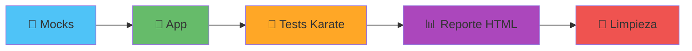

# GTOOL - Component Testing Orchestrator

<div align="center">

[](https://go.dev/)


[](LICENSE)

**CLI en Go para orquestar pruebas de componente de microservicios: levanta mocks, lanza la app, corre los tests y limpia todo — con un solo comando.**

</div>

---

## 🎯 Qué hace GTOOL



GTOOL reemplaza las herramientas bash internas `go-tool` (tests unitarios/build) y `component` (tests de componente) por un único binario en Go, tipado y con logs estructurados. Automatiza:

1. **Mocks** — levanta servicios de terceros en Docker (PostgreSQL, Pub/Sub, Mountebank, Kafka, Couchbase, GCS).
2. **App** — lanza el microservicio bajo prueba (imagen Docker o binarios nativos).
3. **Tests** — ejecuta el suite Karate (backend) contra la app y los mocks.
4. **Reporte** — genera el reporte HTML de Karate y puede abrirlo en el navegador.
5. **Limpieza** — derriba app y mocks siempre, incluso ante fallos o Ctrl-C.

---

## 🚀 Instalación

```bash
git clone <repo-url> && cd gtool

make build              # compila ./bin/gtool
./bin/gtool version     # verifica

make install            # copia el binario a $GOPATH/bin
```

> ⚠️ **`make install` copia a `$GOPATH/bin` (`~/go/bin`).** Si tu terminal no encuentra `gtool` tras instalar, ese directorio no está en tu `PATH`. Agrégalo:
> ```bash
> echo 'export PATH="$PATH:$GOPATH/bin"' >> ~/.zshrc   # o ~/.bashrc
> source ~/.zshrc && rehash
> ```

**Requisitos:** Go 1.24+, Docker, Make.

---

## ⚡ Quick Start

```bash
# 1. Validar la configuración del repo
gtool config validate --config component-config.yml

# 2. Levantar solo los mocks
gtool services up
gtool services status
gtool services down

# 3. Pipeline completo (mocks → app → tests → limpieza)
gtool test
```

GTOOL busca por defecto `./component-config.yml`. Usa `--config <archivo>` para otro.

---

## 📖 Comandos

Todos los comandos aceptan `--config <archivo>`, `--log-level debug|info|warn|error` y `--verbose`.

### `gtool config` — configuración
```bash
gtool config validate --config component-config.yml   # valida el esquema
gtool config show --format yaml                        # imprime la config resuelta
gtool config show --format json
```

### `gtool services` (alias `s`) — mocks de terceros
```bash
gtool services up                     # levanta todos los mocks de la config
gtool s up postgresql kafka           # levanta servicios específicos
gtool s status                        # estado de los servicios
gtool s logs postgresql               # logs de un servicio
gtool s down                          # detiene todos
```

### `gtool app` — aplicación bajo prueba
```bash
gtool app start --docker-image myapp:latest --port 8080
gtool app status
gtool app logs --tail 100
gtool app stop
```

### `gtool unit` (alias `u`) — tests unitarios
Reproduce `go-tool u`: genera los mocks de `build-config.yml` (mockgen) y corre el suite con Ginkgo, dejando cobertura y reporte JUnit en `./coverage`.
```bash
gtool unit
gtool unit --skip-mocks               # solo corre los tests
gtool unit --build-config build-config.yml
```

### `gtool test` — pipeline de componente
```bash
gtool test                            # pipeline nativo de gtool (imágenes públicas)
gtool test karate                     # solo Karate (mocks y app ya levantados)
gtool test karate --tags "@smoke" --no-open
```

### `gtool generate` / `gtool version`
```bash
gtool generate config                 # genera un component-config.yml de ejemplo
gtool version
```

---

## 🔁 Reproducir el flujo DIA (`go-tool` / `component`)

Para repos que hoy usan las herramientas bash internas, GTOOL reproduce su comportamiento usando las **imágenes STABLE** privadas y el contrato exacto (red, puertos, montajes, env). Estas rutas son **opt-in** (`--stable`, `--native`) y no alteran el comportamiento nativo de gtool ni el `component-config.yml`.

| Herramienta DIA | Equivalente en GTOOL |
|-----------------|----------------------|
| `go-tool u` | `gtool unit` |
| `component m` (mocks) | `gtool services up --stable` |
| `component r` / `p` (app) | `gtool app start --native` / `gtool app stop --native` |
| `component e` (solo tests) | `gtool test karate` |
| `component t` (pipeline) | `gtool test --stable` |

### Pipeline completo en un comando
```bash
gtool test --stable
```
Esto, en orden: levanta los mocks STABLE → lanza los binarios nativos de la app → corre Karate → **derriba app y mocks siempre** (incluso si los tests fallan o haces Ctrl-C). Flags: `--tags`, `--build-config`, `--no-open`.

### Paso a paso (equivalente, útil para depurar)
```bash
gtool services up --stable            # = component m
gtool app start --native              # = component r  (necesita los binarios en $GOPATH/bin)
gtool test karate                     # = component e  (abre el reporte HTML al terminar)
gtool app stop --native               # = component p
gtool services down --stable          # detiene los mocks STABLE
```

**Detalles del contrato reproducido:**
- **Mocks STABLE** — `postgresql` (`-p 5432`, monta `test/component/mocks-data/postgresql` → `/data`), `pubsub` (`-p 9085`, env `PROJECT_ID` + `TOPICS` derivados de la config), `mountebank` (`--net=host`, monta `mocks-data/mountebank` → `/imposters`); nombres de contenedor fijos, `--init` y *skip-pull* si la imagen ya está local.
- **App nativa** — lanza `<repo>-<binario>` desde `$GOPATH/bin` (binarios de `build-config.yml`) en puertos `8080+`, con `CUSTOM_SERVER_ADDRESS=0.0.0.0:7080+` y `PUBSUB_EMULATOR_HOST` / `STORAGE_EMULATOR_HOST`.
- **Karate** — corre `test-launcher-back:STABLE` en `--net=host`, monta `test/component/features` → `/app/features` y escribe el reporte en `test/component/reports`; al terminar abre `karate-summary.html` (desactiva con `--no-open`).

> Los binarios de la app deben estar compilados en `$GOPATH/bin` antes de `--native` (p. ej. `go build -o $GOPATH/bin/<repo>-<bin> ./cmd/...`).

---

## 🧩 Configuración

GTOOL usa dos archivos (extensión `.yml` preferida; `.yaml` soportado):

### `component-config.yml` — pipeline de componente
```yaml
version: v1
app-technology: golang            # golang | nodejs | generic
test-launcher: test-launcher-back
third-party:
  mocks: [postgresql, pubsub, mountebank]
  mock-config:
    pubsub:
      project-id: my-project
      topics:
        - topic-id: my-topic
          subscription-ids: [my-sub]
```

### `build-config.yml` — binarios y mocks de Go (para `gtool unit` / `--native`)
```yaml
version: v5
build:
  binaries:
    - name: api
      path: cmd/server/main.go
mocks:
  - source: internal/service/foo_interface.go
    filename: foo_interface.go
```

---

## 🏗️ Arquitectura


- **Plugins** (`internal/plugin/`): `ServicePlugin` (mocks), `AppLauncher`, `TestExecutor`, registrados en un `PluginRegistry` thread-safe.
- **Compat DIA**: `internal/core/mock/stablemocks` (`--stable`), `internal/core/app/nativeapp` (`--native`), `internal/core/test/stablekarate` (`gtool test karate`).
- **Errores tipados** (`pkg/errors`) y **logging estructurado** con Zap (`pkg/logger`).

---

## 🛠️ Desarrollo

```bash
make build          # compila ./bin/gtool
make test           # tests con -race
make test-coverage  # reporte HTML de cobertura
make lint           # golangci-lint
make fmt            # gofmt + goimports
make clean          # limpia artefactos
make help           # lista todos los targets
```

**Estándares:** mínimo 80% de cobertura para código nuevo (95%+ en config/orquestación), tests table-driven, errores de `pkg/errors`, conventional commits. Ver [CLAUDE.md](CLAUDE.md).

Tests de integración (requieren Docker) por plugin:
```bash
go test -tags=integration ./internal/plugin/services/...
```

---

## 📦 Estado

Pipeline funcional end-to-end: 6 plugins de mock, lanzador de app (Docker y nativo), runner Karate y orquestación con teardown garantizado. Compatibilidad con el flujo DIA (`go-tool`/`component`) vía rutas opt-in. 185 tests en verde.

| Fase | Estado |
|------|--------|
| 1. Fundamentos (CLI, config, plugins, errores, logging) | ✅ |
| 2. Mocks (6 plugins) | ✅ |
| 3. App Launcher (Docker + nativo) | ✅ |
| 4. Test Executor (Karate) | ✅ |
| 5. Orquestación (pipeline + teardown) | ✅ |
| 6–7. Features avanzadas, docs/release | 🔄 |

---

