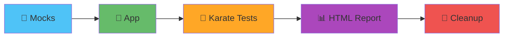
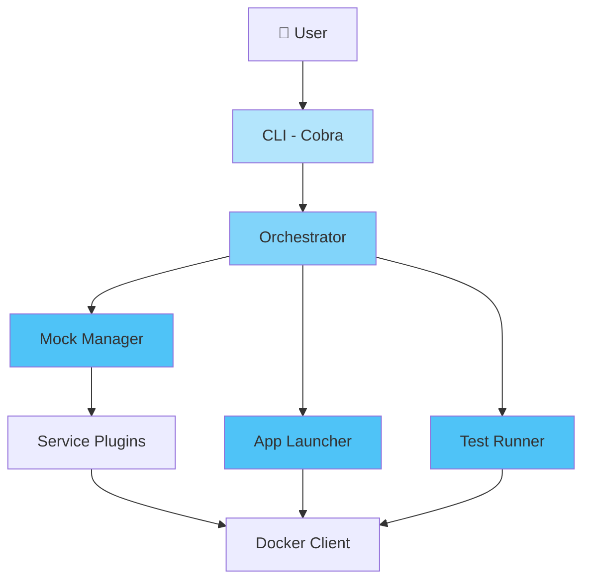

# GTOOL - Component Testing Orchestrator

> 🌐 **Language:** English · [Español](docs/readme/README.es.md)

<div align="center">

[](https://go.dev/)


[](LICENSE)

**A Go CLI to orchestrate microservice component tests: spin up mocks, launch the app, run the tests and clean everything up — with a single command.**

</div>

---

## 🎯 What GTOOL does



GTOOL replaces the internal bash tools `go-tool` (unit tests/build) and `component` (component tests) with a single Go binary — typed and with structured logging. It automates:

1. **Mocks** — starts third-party services in Docker (PostgreSQL, Pub/Sub, Mountebank, Kafka, Couchbase, GCS).
2. **App** — launches the microservice under test (Docker image or native binaries).
3. **Tests** — runs the Karate suite (backend) against the app and the mocks.
4. **Report** — generates the Karate HTML report and can open it in the browser.
5. **Cleanup** — always tears down app and mocks, even on failures or Ctrl-C.

---

## 🚀 Installation

```bash
git clone <repo-url> && cd gtool

make build              # builds ./bin/gtool
./bin/gtool version     # verify

make install            # copies the binary to $GOPATH/bin
```

> ⚠️ **`make install` copies to `$GOPATH/bin` (`~/go/bin`).** If your terminal can't find `gtool` after installing, that directory is not on your `PATH`. Add it:
> ```bash
> echo 'export PATH="$PATH:$GOPATH/bin"' >> ~/.zshrc   # or ~/.bashrc
> source ~/.zshrc && rehash
> ```

**Requirements:** Go 1.24+, Docker, Make.

---

## ⚡ Quick Start

```bash
# 1. Validate the repo configuration
gtool config validate --config component-config.yml

# 2. Start the mocks only
gtool services up
gtool services status
gtool services down

# 3. Full pipeline (mocks → app → tests → cleanup)
gtool test
```

GTOOL looks for `./component-config.yml` by default. Use `--config <file>` for another one.

---

## 📖 Commands

Every command accepts `--config <file>`, `--log-level debug|info|warn|error` and `--verbose`.

### `gtool config` — configuration
```bash
gtool config validate --config component-config.yml   # validates the schema
gtool config show --format yaml                        # prints the resolved config
gtool config show --format json
```

### `gtool services` (alias `s`) — third-party mocks
```bash
gtool services up                     # starts every mock in the config
gtool s up postgresql kafka           # starts specific services
gtool s status                        # services status
gtool s logs postgresql               # logs of a service
gtool s down                          # stops all
```

### `gtool app` — application under test
```bash
gtool app start --docker-image myapp:latest --port 8080
gtool app status
gtool app logs --tail 100
gtool app stop
```

### `gtool unit` (alias `u`) — unit tests
Reproduces `go-tool u`: generates the mocks from `build-config.yml` (mockgen) and runs the suite with Ginkgo, leaving coverage and the JUnit report in `./coverage`.
```bash
gtool unit
gtool unit --skip-mocks               # runs the tests only
gtool unit --build-config build-config.yml
```

### `gtool test` — component pipeline
```bash
gtool test                            # gtool-native pipeline (public images)
gtool test karate                     # Karate only (mocks and app already up)
gtool test karate --tags "@smoke" --no-open
```

### `gtool generate` / `gtool version`
```bash
gtool generate config                 # generates a sample component-config.yml
gtool version
```

---

## 🔁 Reproducing the DIA flow (`go-tool` / `component`)

For repos that currently use the internal bash tools, GTOOL reproduces their behavior using the private **STABLE images** and the exact contract (network, ports, mounts, env). These paths are **opt-in** (`--stable`, `--native`) and do not alter gtool's native behavior or the `component-config.yml`.

| DIA tool | GTOOL equivalent |
|-----------------|----------------------|
| `go-tool u` | `gtool unit` |
| `component m` (mocks) | `gtool services up --stable` |
| `component r` / `p` (app) | `gtool app start --native` / `gtool app stop --native` |
| `component e` (tests only) | `gtool test karate` |
| `component t` (pipeline) | `gtool test --stable` |

### Full pipeline in one command
```bash
gtool test --stable
```
This runs, in order: start the STABLE mocks → launch the app's native binaries → run Karate → **always tear down app and mocks** (even if the tests fail or you Ctrl-C). Flags: `--tags`, `--build-config`, `--no-open`.

### Step by step (equivalent, handy for debugging)
```bash
gtool services up --stable            # = component m
gtool app start --native              # = component r  (needs the binaries in $GOPATH/bin)
gtool test karate                     # = component e  (opens the HTML report when done)
gtool app stop --native               # = component p
gtool services down --stable          # stops the STABLE mocks
```

**Details of the reproduced contract:**
- **STABLE mocks** — `postgresql` (`-p 5432`, mounts `test/component/mocks-data/postgresql` → `/data`), `pubsub` (`-p 9085`, env `PROJECT_ID` + `TOPICS` derived from the config), `mountebank` (`--net=host`, mounts `mocks-data/mountebank` → `/imposters`); fixed container names, `--init` and *skip-pull* if the image is already local.
- **Native app** — launches `<repo>-<binary>` from `$GOPATH/bin` (binaries from `build-config.yml`) on ports `8080+`, with `CUSTOM_SERVER_ADDRESS=0.0.0.0:7080+` and `PUBSUB_EMULATOR_HOST` / `STORAGE_EMULATOR_HOST`.
- **Karate** — runs `test-launcher-back:STABLE` on `--net=host`, mounts `test/component/features` → `/app/features` and writes the report to `test/component/reports`; when done it opens `karate-summary.html` (disable with `--no-open`).

> The app binaries must be built in `$GOPATH/bin` before `--native` (e.g. `go build -o $GOPATH/bin/<repo>-<bin> ./cmd/...`).

---

## 🧩 Configuration

GTOOL uses two files (`.yml` extension preferred; `.yaml` supported):

### `component-config.yml` — component pipeline
```yaml
version: v1
app-technology: golang            # golang | nodejs | generic
test-launcher: test-launcher-back
third-party:
  mocks: [postgresql, pubsub, mountebank]
  mock-config:
    pubsub:
      project-id: my-project
      topics:
        - topic-id: my-topic
          subscription-ids: [my-sub]
```

### `build-config.yml` — Go binaries and mocks (for `gtool unit` / `--native`)
```yaml
version: v5
build:
  binaries:
    - name: api
      path: cmd/server/main.go
mocks:
  - source: internal/service/foo_interface.go
    filename: foo_interface.go
```

---

## 🏗️ Architecture



- **Plugins** (`internal/plugin/`): `ServicePlugin` (mocks), `AppLauncher`, `TestExecutor`, registered in a thread-safe `PluginRegistry`.
- **DIA compat**: `internal/core/mock/stablemocks` (`--stable`), `internal/core/app/nativeapp` (`--native`), `internal/core/test/stablekarate` (`gtool test karate`).
- **Typed errors** (`pkg/errors`) and **structured logging** with Zap (`pkg/logger`).

---

## 🛠️ Development

```bash
make build          # builds ./bin/gtool
make test           # tests with -race
make test-coverage  # HTML coverage report
make lint           # golangci-lint
make fmt            # gofmt + goimports
make clean          # cleans artifacts
make help           # lists every target
```

**Standards:** minimum 80% coverage for new code (95%+ for config/orchestration), table-driven tests, errors from `pkg/errors`, conventional commits. See [CLAUDE.md](CLAUDE.md).

Integration tests (require Docker) per plugin:
```bash
go test -tags=integration ./internal/plugin/services/...
```

---

## 📦 Status

Functional end-to-end pipeline: 6 mock plugins, app launcher (Docker and native), Karate runner and orchestration with guaranteed teardown. Compatibility with the DIA flow (`go-tool`/`component`) via opt-in paths. 185 tests passing.

| Phase | Status |
|------|--------|
| 1. Foundation (CLI, config, plugins, errors, logging) | ✅ |
| 2. Mocks (6 plugins) | ✅ |
| 3. App Launcher (Docker + native) | ✅ |
| 4. Test Executor (Karate) | ✅ |
| 5. Orchestration (pipeline + teardown) | ✅ |
| 6–7. Advanced features, docs/release | 🔄 |

---
