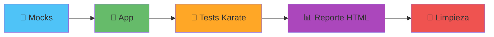
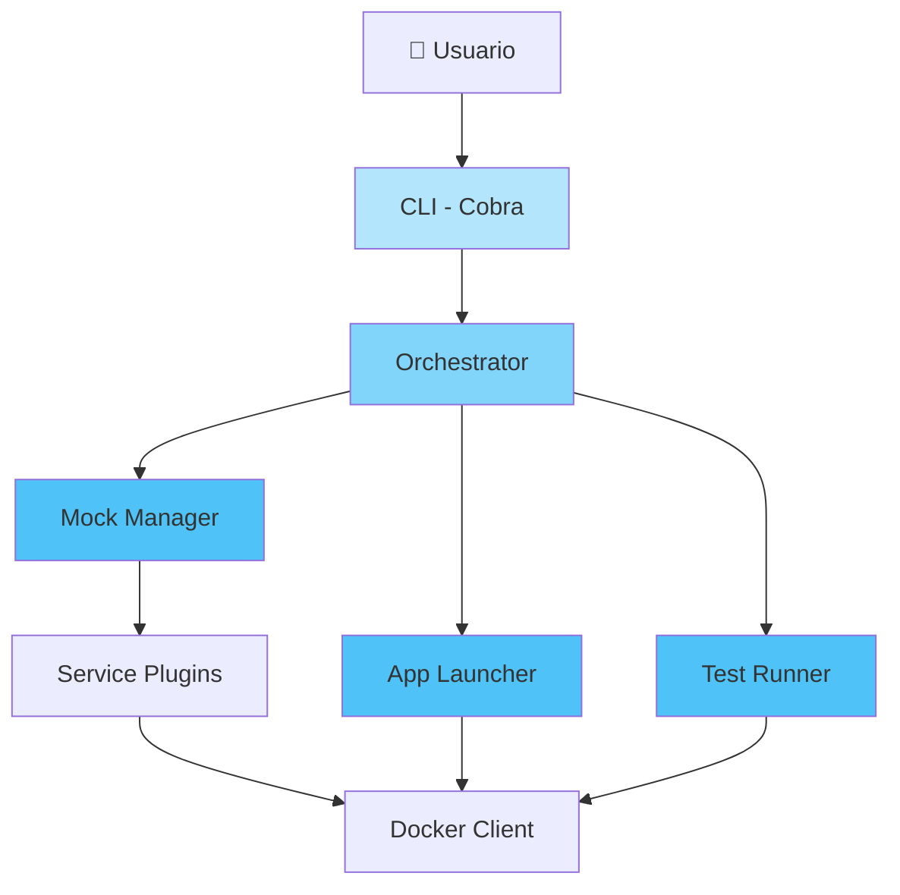

# GTOOL - Component Testing Orchestrator

> 🌐 **Idioma:** Español · [English](../../README.md)

<div align="center">

[](https://go.dev/)


[](../../LICENSE)

**CLI en Go para orquestar pruebas de componente de microservicios: levanta mocks, lanza la app, corre los tests y limpia todo — con un solo comando.**

</div>

---

## 🎯 Qué hace GTOOL

GTOOL es un orquestador CLI para **pruebas de componente** de microservicios. Levanta las dependencias externas de un servicio como mocks, lanza el servicio, ejecuta su suite de tests contra ese entorno aislado y lo derriba todo — de forma reproducible y con un solo comando. Reemplaza configuraciones de Docker gestionadas a mano y scripts de shell ad-hoc por un único binario en Go, tipado, con logs estructurados, validación estricta de configuración y una arquitectura de plugins.



**Un solo `gtool test` corre el pipeline completo:**

1. **Mocks** — levanta las dependencias de terceros en Docker. 10 servicios incorporados: PostgreSQL, MySQL, MongoDB, Redis, Kafka, Pub/Sub, Couchbase, GCS, MinIO y Mountebank.
2. **App** — lanza el servicio bajo prueba, como imagen Docker o como binarios nativos.
3. **Tests** — ejecuta la suite Karate (API backend) contra la app y sus mocks.
4. **Reporte** — genera el reporte HTML de Karate y puede abrirlo en el navegador.
5. **Limpieza** — derriba app y mocks siempre, incluso ante fallos o Ctrl-C.

Además del pipeline, GTOOL también corre **tests unitarios** (`gtool unit` — generación de mocks + Ginkgo) y puede ejecutar cada fase por separado (`gtool services`, `gtool app`, `gtool test karate`). Los nuevos servicios mock se conectan mediante la interfaz `ServicePlugin`.

---

## 🚀 Instalación

```bash
git clone <repo-url> && cd gtool

make build              # compila ./bin/gtool
./bin/gtool version     # verifica

make install            # copia el binario a $GOPATH/bin
```

> ⚠️ **`make install` copia a `$GOPATH/bin` (`~/go/bin`).** Si tu terminal no encuentra `gtool` tras instalar, ese directorio no está en tu `PATH`. Agrégalo:
> ```bash
> echo 'export PATH="$PATH:$GOPATH/bin"' >> ~/.zshrc   # o ~/.bashrc
> source ~/.zshrc && rehash
> ```

**Requisitos:** Go 1.24+, Docker, Make.

---

## ⚡ Quick Start

```bash
# 1. Validar la configuración del repo
gtool config validate --config component-config.yml

# 2. Levantar solo los mocks
gtool services up
gtool services status
gtool services down

# 3. Pipeline completo (mocks → app → tests → limpieza)
gtool test
```

GTOOL busca por defecto `./component-config.yml`. Usa `--config <archivo>` para otro.

---

## 📖 Comandos

Todos los comandos aceptan `--config <archivo>`, `--log-level debug|info|warn|error` y `--verbose`.

### `gtool config` — configuración
```bash
gtool config validate --config component-config.yml   # valida el esquema
gtool config show --format yaml                        # imprime la config resuelta
gtool config show --format json
```

### `gtool services` (alias `s`) — mocks de terceros
```bash
gtool services up                     # levanta todos los mocks de la config
gtool s up postgresql kafka           # levanta servicios específicos
gtool s status                        # estado de los servicios
gtool s logs postgresql               # logs de un servicio
gtool s down                          # detiene todos
```

### `gtool app` — aplicación bajo prueba
```bash
gtool app start --docker-image myapp:latest --port 8080
gtool app status
gtool app logs --tail 100
gtool app stop
```

### `gtool unit` (alias `u`) — tests unitarios
Genera los mocks de `build-config.yml` (mockgen) y corre el suite con Ginkgo, dejando cobertura y reporte JUnit en `./coverage`.
```bash
gtool unit
gtool unit --skip-mocks               # solo corre los tests
gtool unit --build-config build-config.yml
```

### `gtool test` — pipeline de componente
```bash
gtool test                            # pipeline nativo de gtool (imágenes públicas)
gtool test karate                     # solo Karate (mocks y app ya levantados)
gtool test karate --tags "@smoke" --no-open
```

### `gtool generate` / `gtool version`
```bash
gtool generate config                 # genera un component-config.yml de ejemplo
gtool version
```

---

## 🧩 Configuración

GTOOL usa dos archivos (extensión `.yml` preferida; `.yaml` soportado):

### `component-config.yml` — pipeline de componente
```yaml
version: v1
app-technology: golang            # golang | nodejs | generic
test-launcher: test-launcher-back
third-party:
  mocks: [postgresql, pubsub, mountebank]
  mock-config:
    pubsub:
      project-id: my-project
      topics:
        - topic-id: my-topic
          subscription-ids: [my-sub]
```

### `build-config.yml` — binarios y mocks de Go (para `gtool unit`)
```yaml
version: v5
build:
  binaries:
    - name: api
      path: cmd/server/main.go
mocks:
  - source: internal/service/foo_interface.go
    filename: foo_interface.go
```

---

## 🏗️ Arquitectura



- **Plugins** (`internal/plugin/`): `ServicePlugin` (mocks), `AppLauncher`, `TestExecutor`, registrados en un `PluginRegistry` thread-safe.
- **Errores tipados** (`pkg/errors`) y **logging estructurado** con Zap (`pkg/logger`).

---

## 🛠️ Desarrollo

```bash
make build          # compila ./bin/gtool
make test           # tests con -race
make test-coverage  # reporte HTML de cobertura
make lint           # golangci-lint
make fmt            # gofmt + goimports
make clean          # limpia artefactos
make help           # lista todos los targets
```

**Estándares:** mínimo 80% de cobertura para código nuevo (95%+ en config/orquestación), tests table-driven, errores de `pkg/errors`, conventional commits. Ver [CLAUDE.md](CLAUDE.md).

Tests de integración (requieren Docker) por plugin:
```bash
go test -tags=integration ./internal/plugin/services/...
```

---

## ⚠️ Limitaciones conocidas

- **Networking app→mock en Linux (`gtool test` nativo).** El pipeline por defecto corre la app como contenedor en red bridge, mientras los mocks publican sus puertos en el host, así que una app en contenedor no alcanza un mock en `localhost`. Necesita un host gateway (`host.docker.internal`, automático en Docker Desktop, manual en Linux) o una red Docker compartida. El path `--stable` / `--native` lo evita corriendo la app como procesos nativos que llegan a los mocks por `127.0.0.1` (mountebank corre en la red del host).
- **Los mocks nuevos están poco probados.** `redis`, `mongodb`, `mysql` y `minio` hoy solo tienen unit tests — aún sin integration tests con Docker. Considéralos experimentales.
- **El resultado de Karate es por exit-code.** El pass/fail viene del exit code del launcher; no hay parsing por escenario del output de `karate-reports`.

---

## 📦 Estado

Pipeline funcional end-to-end: 10 plugins de mock, lanzador de app (Docker y nativo), runner Karate y orquestación con teardown garantizado. 185 tests en verde.

| Fase | Estado |
|------|--------|
| 1. Fundamentos (CLI, config, plugins, errores, logging) | ✅ |
| 2. Mocks (6 plugins) | ✅ |
| 3. App Launcher (Docker + nativo) | ✅ |
| 4. Test Executor (Karate) | ✅ |
| 5. Orquestación (pipeline + teardown) | ✅ |
| 6–7. Features avanzadas, docs/release | 🔄 |

---

